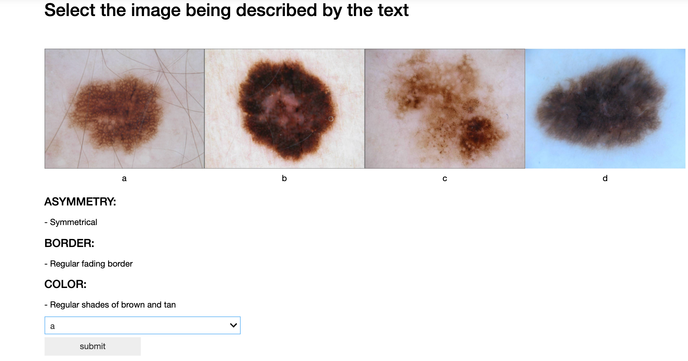

# Match the description to the Nevi

This repository contains a notebook for doing a simple "forced choice" experiment. Each participating student has provided a written description of each nevi depicted in the notebook. Your task is to choose which nevi (photograph) is being described. Choose the appropriate label from the dropdown menu and click on submit. This will save your response and bring up the next description.

